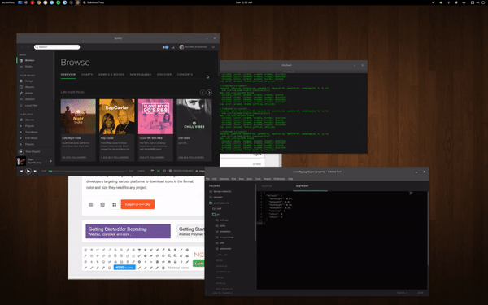

## PyGrid ##

PyGrid is a small utility which allows you to easily organize your open windows by tiling, resizing and positioning them to make the best use of your desktop real estate.

#### Requirements ####
* X11-based desktop and Python3
* python3-gi python3-xlib

#### Shortcuts ####
* `ALT`+`CTRL`+`NUMPAD-1` - Move window to bottom left.
* `ALT`+`CTRL`+`NUMPAD-2` - Move window to bottom.
* `ALT`+`CTRL`+`NUMPAD-3` - Move window to bottom right.
* `ALT`+`CTRL`+`NUMPAD-4` - Move window to left.
* `ALT`+`CTRL`+`NUMPAD-5` - Move window to center.
* `ALT`+`CTRL`+`NUMPAD-6` - Move window to right.
* `ALT`+`CTRL`+`NUMPAD-7` - Move window to top left.
* `ALT`+`CTRL`+`NUMPAD-8` - Move window to top.
* `ALT`+`CTRL`+`NUMPAD-9` - Move window to top right.

Repeatedly press one of the defined keybindings to cycle through window sizes available at the desired location on the screen.

#### Configuration ####
Configuration is done via a JSON file located at `~/.config/pygrid.json` which will be created with default options if not found when starting up. The default configuration is below. If you introduce top level sections `'monitor0': {...}` or `'monitor1': {...}` to provide different options for each monitor on your system.  Any settings not defined will fall back to user-defined defaults, then global defaults. NOTE: Updating configuration in this JSON file does *not* require you to restart PyGrid.

```javascript
{
  'default': {
    'xdivs': 3,               // number of x divisions for the screen.
    'ydivs': 2,               // number of y divisions for the screen.
    'padding': [0, 0, 0, 0],  // additional top, right, bottom, left padding in pixels.
    'spacing': 4,             // spacing between windows in pixels.
    'minwidth': 0.25,         // min percent width of window.
    'maxwidth': 0.67,         // max percent width of window.
    'minheight': 0.33,        // min percent height of window.
    'maxheight': 0.67,        // max percent height of window.
  },
  'monitor0': { ... },        // Repeat any settings above specific for monitor 0.
  'monitor1': { ... },        // Repeat any settings above specific for monitor 1.
  'monitor<NUM>': { ... },    // Repeat any settings above specific for monitor <NUM>.
}
```

#### Credit & License ####
PyGrid was original a fork of [QuickTile by ssokolow](https://github.com/ssokolow/quicktile), but rewritten to allow a much easier configuration as well as updated code to run on Python3 & GTK3. Code released under GPLv2 License.
